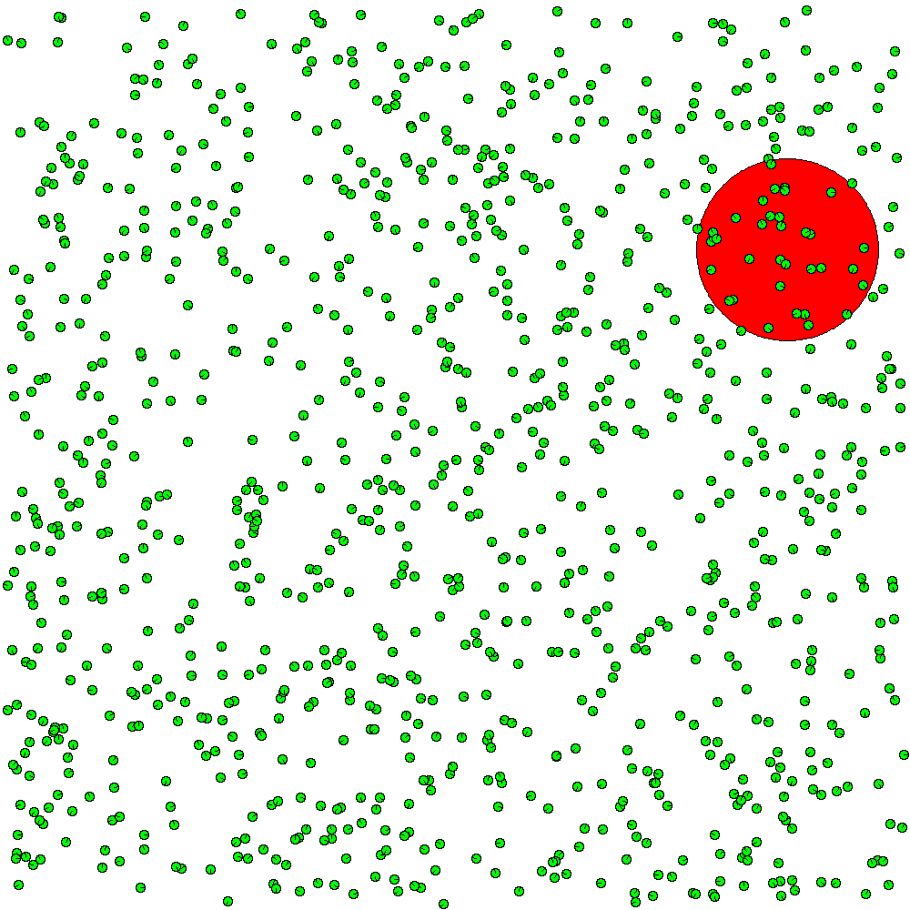

# Interaction Rules

Notebook code to reproduce the experiments of the paper "Interaction Rules Supporting Effective Flocking Behavior"
To run the code Evojax is needed https://github.com/google/evojax

</img></img>

